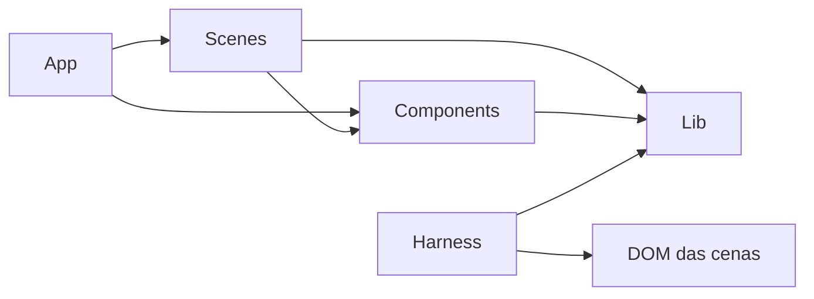

# Arquitetura do Leovox Portfolio

## Forma do produto

O portfólio é um filme contínuo em React. Cada cena é dona do seu DOM, estilo e coreografia. O scroll global é conduzido por Lenis; GSAP e ScrollTrigger coordenam movimento; o canvas persistente atravessa cenas sem remontar.

## Limites

| Camada             | Responsabilidade                                         | Local                         |
| ------------------ | -------------------------------------------------------- | ----------------------------- |
| Aplicação          | Composição e ciclo global                                | `src/App.tsx`, `src/main.tsx` |
| Cenas              | Semântica, visual e movimento local                      | `src/scenes/`                 |
| Componentes        | Elementos reutilizáveis sem regra de uma cena específica | `src/components/`             |
| Infra de movimento | Instâncias únicas de GSAP e Lenis                        | `src/lib/`                    |
| Harness no browser | Controle e observação determinísticos sob demanda        | `src/harness/`                |
| Harness de agentes | Catálogo, dependências, roteamento e evidências          | `harness/agents/`             |
| Contratos          | Critérios executáveis por cena                           | `docs/scene-contracts/`       |
| Testes             | Unidade, arquitetura e browser                           | `tests/`, `harness/browser/`  |

## Dependências permitidas

Cenas não importam outras cenas. `src/lib/` não importa componentes ou cenas. O harness observa o produto por atributos `data-harness-scene` e pelas instâncias centrais de Lenis e ScrollTrigger.

## Estado e animação

- Conteúdo e ordem de leitura vivem no DOM.
- Estado visual transitório vive na cena que o cria e precisa ser limpo no teardown.
- Scroll de câmera pode ser scrubado.
- Gestos internos executam em tempo real depois do gatilho.
- Reduced motion preserva conteúdo, navegação e hierarquia.

## Decisões arquiteturais

Decisões públicas e técnicas ficam em `docs/decisions/`. O registro criativo privado `docs/DECISOES.md` continua local. Novas decisões que afetem agentes, contratos, CI ou arquitetura ganham um ADR público.
