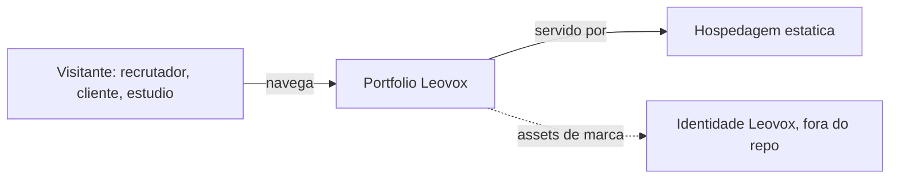
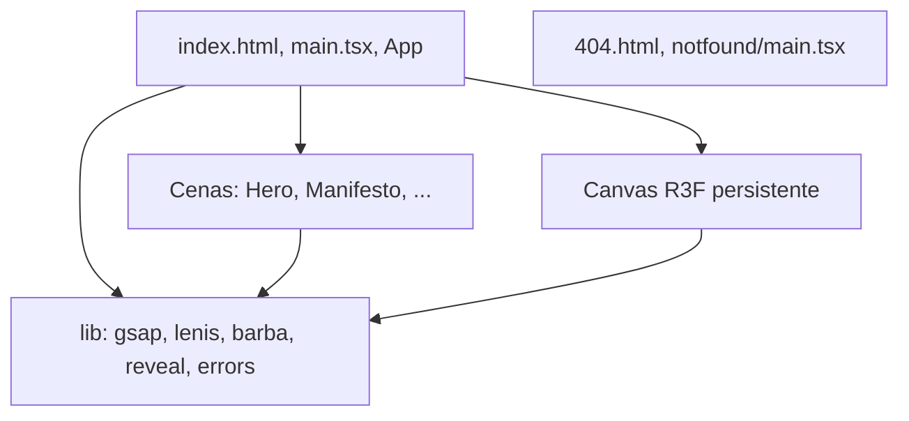
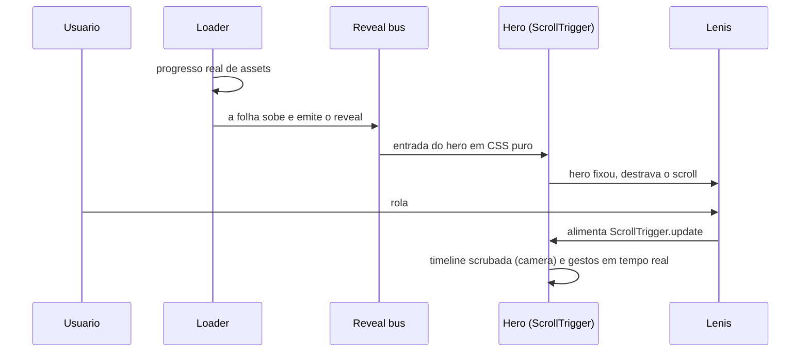

# 3.2 Diagramas

## Contexto (C4 nível 1)

```mermaid
flowchart LR
  V["Visitante: recrutador, cliente, estudio"] -->|navega| S["Portfolio Leovox"]
  S -->|servido por| H["Hospedagem estatica"]
  S -.->|assets de marca| ID["Identidade Leovox, fora do repo"]
```

## Containers (C4 nível 2)

```mermaid
flowchart TB
  HOME["index.html, main.tsx, App"]
  NF["404.html, notfound/main.tsx"]
  CANVAS["Canvas R3F persistente"]
  SCENES["Cenas: Hero, Manifesto, ..."]
  LIB["lib: gsap, lenis, barba, reveal, errors"]
  HOME --> CANVAS
  HOME --> SCENES
  HOME --> LIB
  SCENES --> LIB
  CANVAS --> LIB
```

## Fluxo de abertura e scroll

```mermaid
sequenceDiagram
  participant U as Usuario
  participant L as Loader
  participant R as Reveal bus
  participant H as Hero (ScrollTrigger)
  participant Le as Lenis
  L->>L: progresso real de assets
  L->>R: a folha sobe e emite o reveal
  R->>H: entrada do hero em CSS puro
  H->>Le: hero fixou, destrava o scroll
  U->>Le: rola
  Le->>H: alimenta ScrollTrigger.update
  H->>H: timeline scrubada (camera) e gestos em tempo real
```

Relacionado: [01-visao-arquitetural](01-visao-arquitetural.md).
